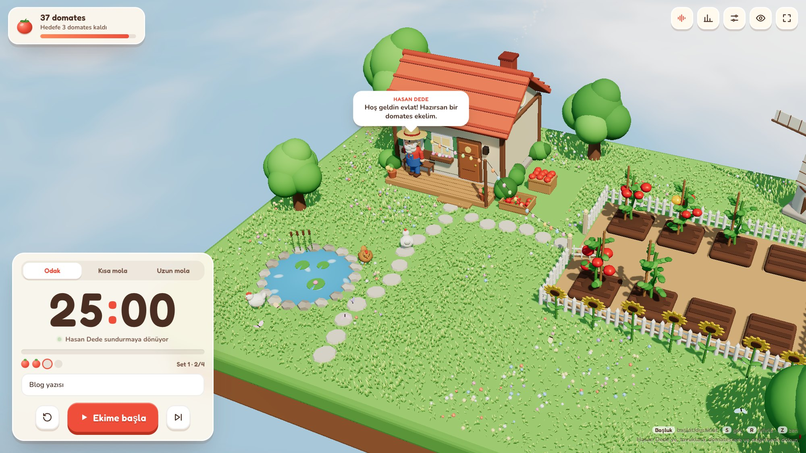
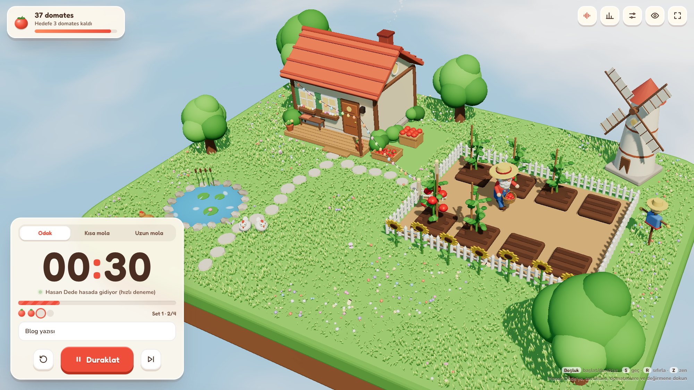
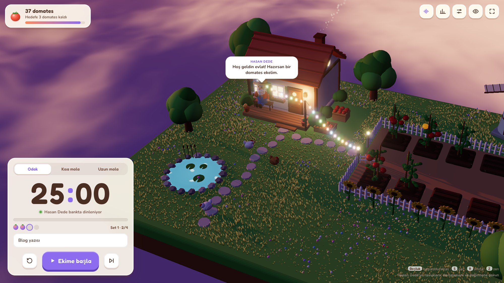
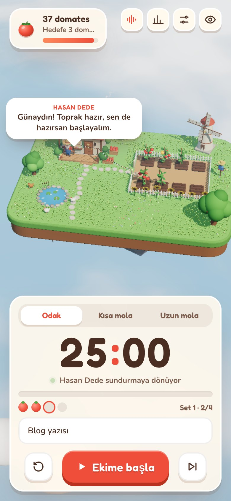

> [!IMPORTANT]
> **Bu proje [Domat](https://github.com/ayhankorkmaz/domat) olarak devam ediyor** · [getdomat.com](https://getdomat.com)<br>
> Görev listesi, hasat defteri, mevsimler, büyüyen çiftlik, çevrimdışı çalışma ve İngilizce. Bu depo arşivlendi; ilk
> tek dosyalık sürüm olarak burada duruyor.
>
> **This project lives on as [Domat](https://github.com/ayhankorkmaz/domat)** · [getdomat.com](https://getdomat.com). This repo is archived.

<div align="center">

# 🍅 Domates Bahçesi

**Sen odaklan, Hasan Dede domatesleri yetiştirsin.**

Minik bir 3D çiftlik oyunu gibi görünen Pomodoro zamanlayıcısı. Her odak seansında bilge çiftçi Hasan Dede bir fide eker; molada sepetini alıp domatesleri toplar.

*A cozy 3D farm Pomodoro timer: every focus session, a bearded old farmer plants a tomato. One HTML file, built with Three.js.*


### [▶ Hemen dene: ayhankorkmaz.github.io/domates-bahcesi](https://ayhankorkmaz.github.io/domates-bahcesi/)



</div>

## Nasıl çalışır

| Sen | Hasan Dede |
| --- | --- |
| **Ekime başla** dersin | Kapıyı açıp bahçeye iner, toprağı çapalar, tohumu eker, fideyi sular, sonra sundurmadaki bankına oturur |
| Odakta kalırsın | Fide büyür: önce yapraklar, sonra sarı çiçekler, ardından yeşil domatesler. Süre bitince kıpkırmızı olurlar |
| Mola verirsin | Sepetini alır, domatesleri tek tek toplar ve kasaya döker. Domatesler fizikle kasaya yuvarlanır |
| Seansı yarıda bırakırsın | Fide kurur. Hasan Dede başını sallar: *"Olsun evlat, toprak affeder."* |

Günlük domates sayın hedefe doğru ilerler. Her 25 domateste bir kasa dolup yığına eklenir. Setin son seansında **altın domates** yetişir.

<table>
<tr>
<td width="50%"><br><sub><b>Hasat:</b> Hasan Dede sepetiyle tarhları dolaşıyor.</sub></td>
<td width="50%"><br><sub><b>Yaz akşamı:</b> uzun molada pencereler ve ampul dizileri yanar, ateş böcekleri çıkar.</sub></td>
</tr>
</table>

## Öne çıkanlar

- **Yaşayan bir çiftlik.** Tavuklar dolaşıp yem arar, kelebekler uçar, yel değirmeni rüzgâra göre döner, bacadan duman tüter.
- **Günün saati fazla göre değişir.** Odakta güneşli öğle, kısa molada altın ikindi, uzun molada yaz akşamı ve yıldızlar.
- **Dokunulacak çok şey var.**
  - Hasan Dede'ye dokun: el sallar, laf atar.
  - Tavuğa dokun: zıplayıp gıdaklar.
  - Domatese dokun: zıplar.
  - Değirmene dokun: hızlanır.
  - Gölete dokun: su sıçrar.
  - Çimene dokun: dalga yayılır.
- **Hepsi kodla üretilen sesler.** Kuşlar, yağmur, rüzgâr ve yaz akşamı ambiyansları var. Efektler arasında kapı gıcırtısı, çapa, sulama, ayak sesi, Hasan Dede'nin ıslığı, gıdaklama ve domates düşme sesleri bulunuyor. Tek bir ses dosyası yok, hepsi WebAudio ile sentezleniyor.
- **Tam bir Pomodoro.**
  - Odak, kısa mola ve uzun mola döngüsü ile set sayacı.
  - Günlük hedef, otomatik başlatma, masaüstü bildirimi, ekranı uyanık tutma ve zen modu.
  - Sayfa yenilense de kaldığı yerden devam eder.
- **Hasat defteri.** Gün serisi, son 7 günün grafiği, rozetler ve görev adlarıyla seans listesi.
- **Hızlı deneme modu.** Ayarlar'dan aç, dakikalar saniyeye dönsün, bütün döngüyü bir dakikada izle.

<div align="center">

<br><sub>Telefonda da çalışır.</sub>
</div>

## Çalıştırma

Tek bir `index.html` dosyası, kurulum yok.

```bash
python3 -m http.server 8000
# tarayıcıda http://localhost:8000
```

- **GitHub Pages:** Depoyu yükle, ardından Settings → Pages → `main` / root. Birkaç dakika içinde yayında olur.
- **Kendi sitene gömme:**
  ```html
  <iframe src="/domates-bahcesi/" style="width:100%;height:100vh;border:0" allow="fullscreen; screen-wake-lock"></iframe>
  ```

## Kısayollar

| Tuş | İşlev |
| --- | --- |
| `Boşluk` | Başlat / duraklat |
| `S` | Sonraki aşamaya geç |
| `R` | Aşamayı sıfırla |
| `Z` | Zen modu (arayüzü gizler) |
| `F` | Tam ekran |
| `M` | Sesi kapat / aç |
| `A` | Ortam sesi menüsü |

## Teknik

- **Three.js r170:** RoundedBox ile yumuşak modeller, ACES ton eşleme, bloom, yumuşak gölgeler, shader ile bulut denizi, gölet ve rüzgârda dalgalanan 14.000 çim yaprağı.
- **cannon-es:** Domateslerin kasaya dökülmesi, tıklanınca zıplaması ve çarpma sesleri.
- **Karakter:** Hasan Dede tamamen ilkel geometrilerden (küre, kapsül, silindir) kurulu. Hareketleri bir görev kuyruğuyla yönetiliyor: yürü, dön, çapala, ek, sula, topla, dök, otur.
- **Veri:** Her şey tarayıcının `localStorage` alanında kalır. Sunucuya hiçbir şey gönderilmez.
- Kütüphaneler jsDelivr'den, fontlar (Fredoka, Nunito) Google Fonts'tan yüklenir.

## Lisans

[MIT](LICENSE). Dilediğin gibi kullan, değiştir, paylaş; telif notunu korumanı yeterli.

---

<div align="center">

**Ayhan Korkmaz** yaptı.

[ayhankorkmaz.com](https://ayhankorkmaz.com) · [X: @ayhankorkmaz_](https://x.com/ayhankorkmaz_)

<sub>Beğendiysen ⭐ bırak. Hasan Dede'nin moralini yükseltiyor.</sub>

</div>
